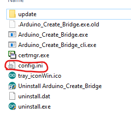
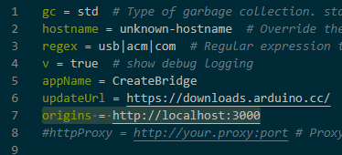

# ArduinoWebSocket-p5js
This example we have a webpage that reads the serial monitor from the Arduino Board and move a ball in the canvas

# Getting Started
#### Needed:
* Node.js - To host the HTML content
* Arduino Create Plugin - To read the serial monitor with WebSockets
* Arduino IDE / Arduino Create
* Arduino Board

#### Setting the things up
##### NodeServer
* Go to NodeServer's folder and install this with the console
* `npm install express@4.15.2`
* `npm install socket.io`

##### Configure Arduino Create Plugin
* Go to the Arduino Create Plugin install Directory and open "Config.ini" we will need to replace the value at `origins=` with "http://localhost:3000" without quotes, the port can be different, see the server console to check.

* Restart the plugin
##### Run the server
* Just go to the directory where you have installed this and type in the CMD `node app.js` or by launching the `run.bat`
##### Normal directory
* Upload a sketch to output serial numbers to an Arduino Board
* Go to http://localhost:3000 and see the output

#### Troubleshooting
* Open the Serial monitor from the IDE / Create to see if there are outputs
* If you have the serial monitor openned close it and reload
* You can open the serial monitor from Create, it doesn't matter
* If you changed the config.ini, restart the plugin to make the changes

