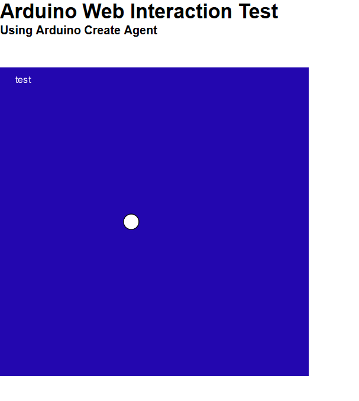

# ArduinoWebSocket-p5js
This example we have a webpage that read the serial monitor from the Arduino Board and move a ball in the canvas

Preview

# Getting Started
#### Needed:
* Node.js - To host the HTML content
* Arduino Create Plugin - To read the serial monitor with WebSockets
* Arduino IDE / Arduino Create
* Arduino Board

#### Setting the things up
* Upload a sketch to output serial numbers to an Arduino Board
* Just go to the directory where you have installed this and type in the CMD `node app.js`
* Go to the Arduino Create Plugin install Directory and open "Config.ini" we will need to replace the value at `origins=` with "http://localhost:3000" without quotes, the port can be different, see the server console to check.
* go to http://localhost:3000 and see the output